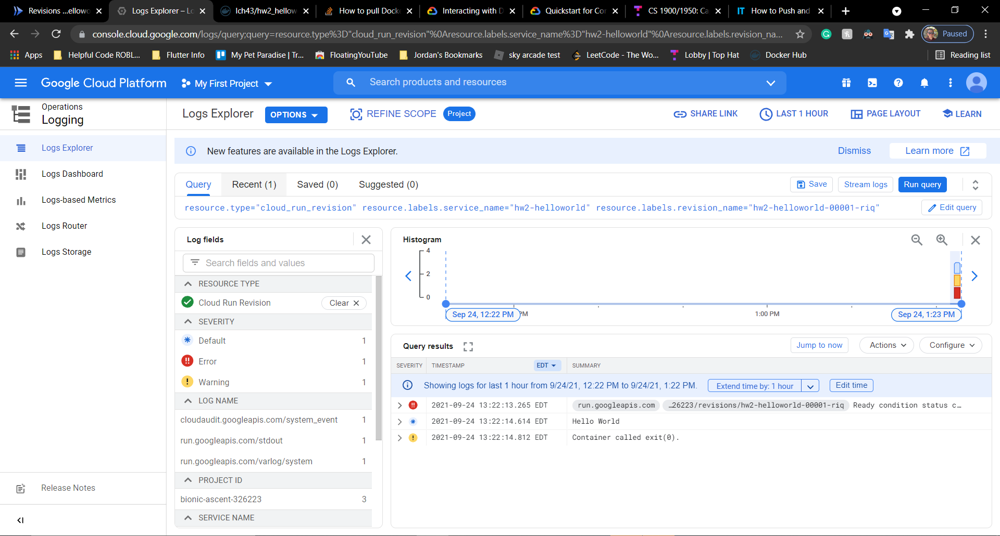
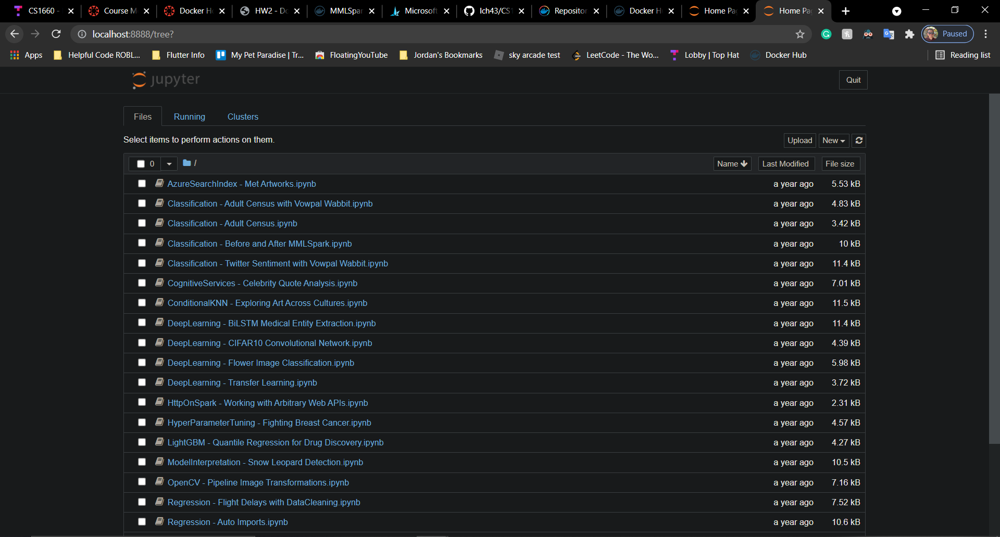
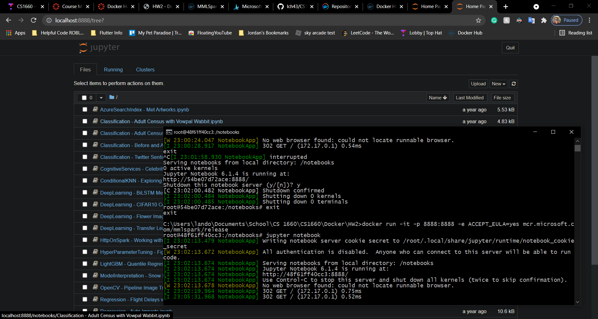

# HW2

## Github repository:
[https://github.com/lch43/CS1660](https://github.com/lch43/CS1660)

## Docker folder:
[https://github.com/lch43/CS1660/tree/main/Docker](https://github.com/lch43/CS1660/tree/main/Docker)

## (5 pts) First Container:
[https://hub.docker.com/r/lch43/hw2_helloworld](https://hub.docker.com/r/lch43/hw2_helloworld)

## (5 pts) Execution on GCP:

## (5 pts) Print for my Dockerfile contents and the source code
Not sure what this means...

## (5 pts) Screenshot for Jupyter

