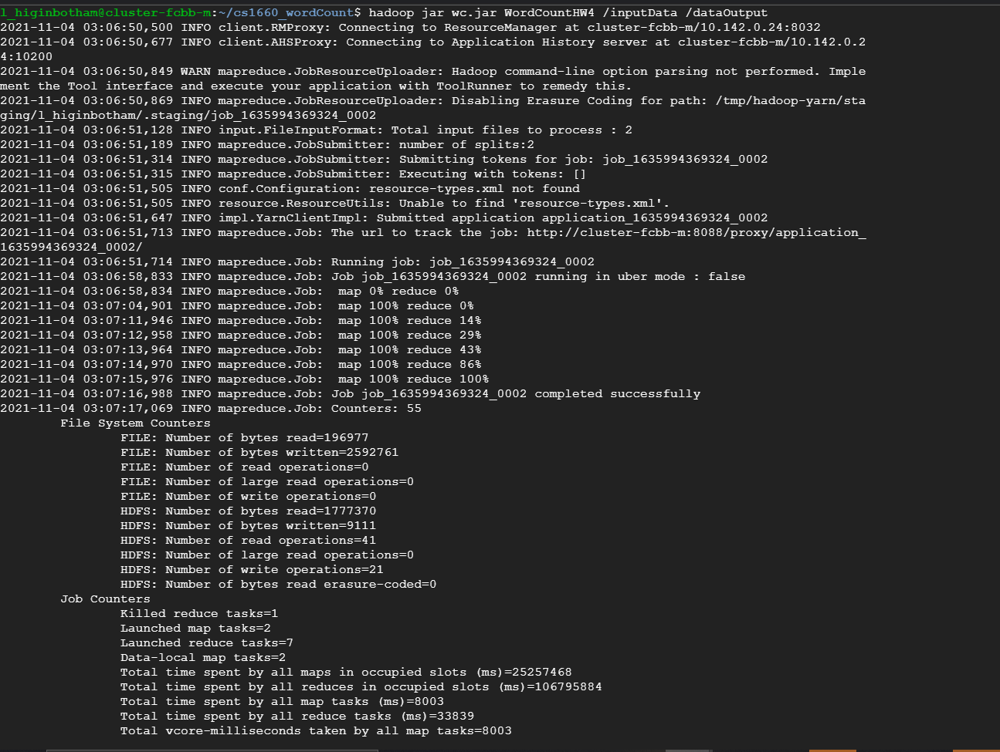
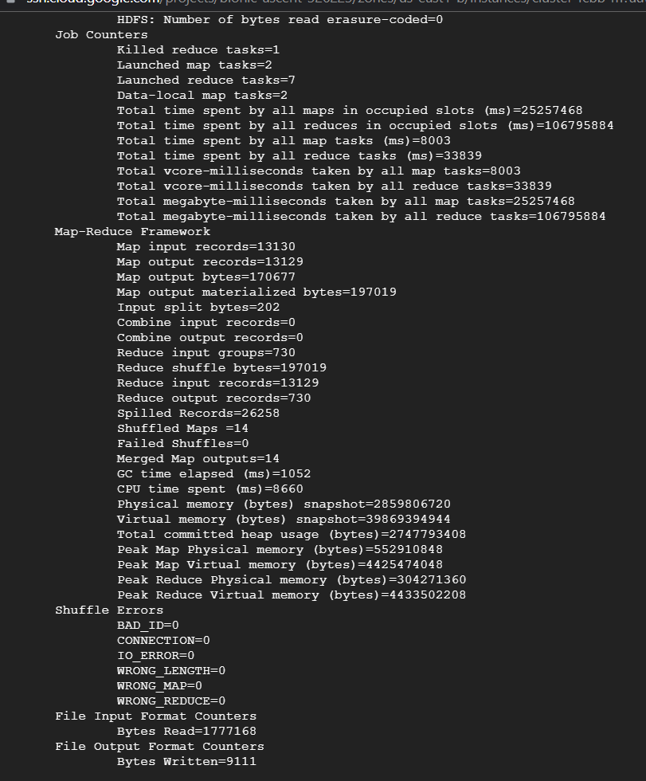

# Copy of Your mapper.py code (or equivalent in another programming language) (25% of total grade)

MaxTemperatureMapper class in WordCountHW4.java

# Copy of Your reducer.py code (or equivalent in another programming language) (25% of total grade)

MaxTemperatureReducer class in WordCountHW4.java

# Screenshot of the execution of Hadoop MapReduce Job in the terminal (25% of total grade)

# Copy of your output file (after merging) containing the results (25% of total grade)

collectedResults.txt