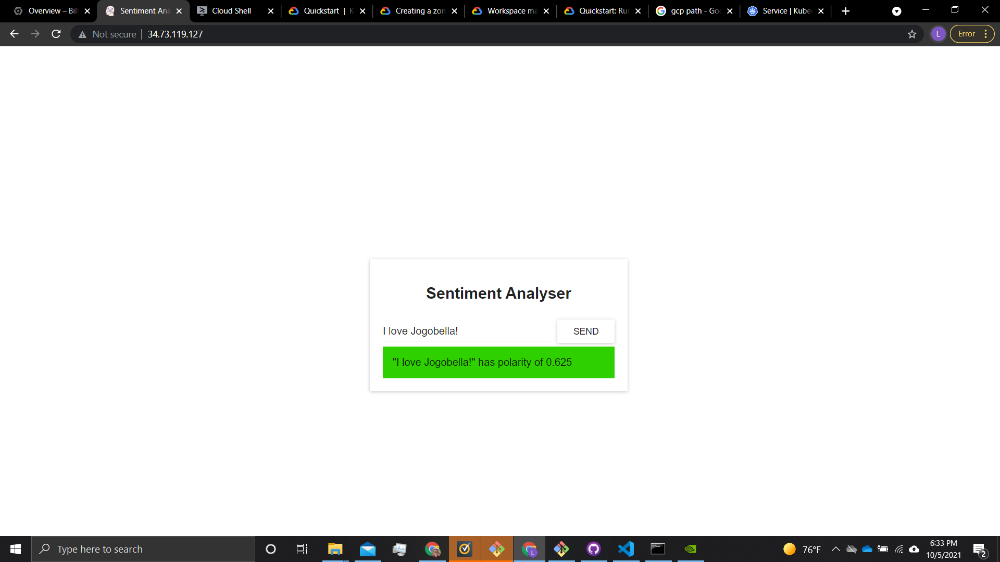
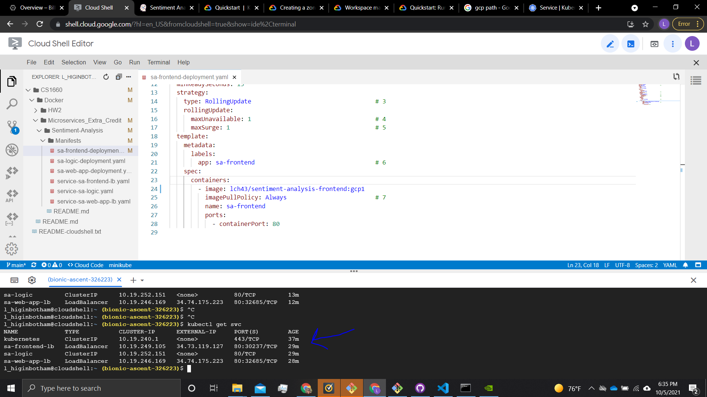
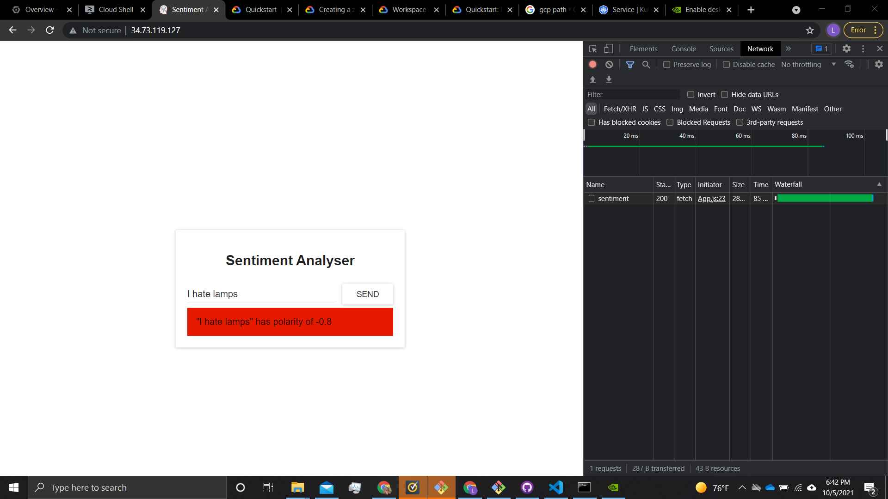

# Extra Credit Mini-project - Sentiment Analysis
This work is based off of the work of https://github.com/rinormaloku/k8s-mastery

## Github repository:
[https://github.com/lch43/CS1660](https://github.com/lch43/CS1660)

## Docker folder:
[https://github.com/lch43/CS1660/tree/main/Docker](https://github.com/lch43/CS1660/tree/main/Docker)

## Current project folder:
[https://github.com/lch43/CS1660/tree/main/Docker/Microservices_Extra_Credit/Sentiment-Analysis](https://github.com/lch43/CS1660/tree/main/Docker/Microservices_Extra_Credit/Sentiment-Analysis)

## (5 pts) Your ReadMe file should list all the steps to get the application to work on Google Kubernetes Engine.

Steps:
1. Ensure billing is turned on.
2. Ensure Kubernetes Engine API is enabled.
3. Set the console to your GCP project.
4. In the console type the command: gcloud container clusters create sentiment-analysis --num-nodes=1 --zone=us-east1-b
5. Enter command: gcloud container clusters get-credentials sentiment-analysis --zone=us-east1-b
6. Enter command: git clone https://github.com/lch43/CS1660
8. Enter command: kubectl create -f CS1660/Docker/Microservices_Extra_Credit/Sentiment-Analysis/Manifests/sa-logic-deployment.yaml
9. Enter command: kubectl create -f CS1660/Docker/Microservices_Extra_Credit/Sentiment-Analysis/Manifests/sa-web-app-deployment.yaml
10. Enter command: kubectl create -f CS1660/Docker/Microservices_Extra_Credit/Sentiment-Analysis/Manifests/service-sa-logic.yaml
11. Enter command: kubectl create -f CS1660/Docker/Microservices_Extra_Credit/Sentiment-Analysis/Manifests/service-sa-frontend-lb.yaml
12. Enter command: kubectl create -f CS1660/Docker/Microservices_Extra_Credit/Sentiment-Analysis/Manifests/service-sa-web-app-lb.yaml
13. Enter command: kubectl get svc
14. Copy the external-ip address from sa-web-app-lb listed from the previous command
15. Download https://github.com/rinormaloku/k8s-mastery/tree/master/sa-frontend and in src/App.js replace localhost:8080 on line 23 with the IP you copied from the last step. A result may look like 'http://34.74.175.223/sentiment'
16. In the original folder of https://github.com/rinormaloku/k8s-mastery/tree/master/sa-frontend run the command: npm run build
17. In that same directory build the docker image and push it to the hub.
18. Replace the image in line 24 of CS1660/Docker/Microservices_Extra_Credit/Sentiment-Analysis/Manifests/sa-frontend-deployment.yaml with the image of the new image created in the last step.
19. Enter command: kubectl create -f CS1660/Docker/Microservices_Extra_Credit/Sentiment-Analysis/Manifests/sa-frontend-deployment.yaml
20. Enter the external-ip for sa-frontend-lb into the address bar on the web browser and you will have access to the live application. To get this address again, enter the command: kubectl get svc
21. Turn off billing when you are done.

## (5 pts) Screenshot for the execution of your application on Google Kubernetes Engine (i.e. screenshot showing the application running on the external IP through your Kubernetes Service)

## (5 pts) List of URLs for all of your Docker Hub images (Make sure they are publicly available). 

[lch43/sentiment-analysis-logic](https://hub.docker.com/r/lch43/sentiment-analysis-logic)
[lch43/sentiment-analysis-frontend](https://hub.docker.com/r/lch43/sentiment-analysis-frontend)
[lch43/sentiment-analysis-webapp](https://hub.docker.com/r/lch43/sentiment-analysis-webapp)

## (5 pts) Video recording of code walkthrough and demo.

[Walkthrough via Box](https://pitt.app.box.com/s/vq3h5dzvfntar2rocan0jb5e7wc1xw8j)

[Walkthrough via YouTube](https://www.youtube.com/watch?v=tTevOFcv1Ek)