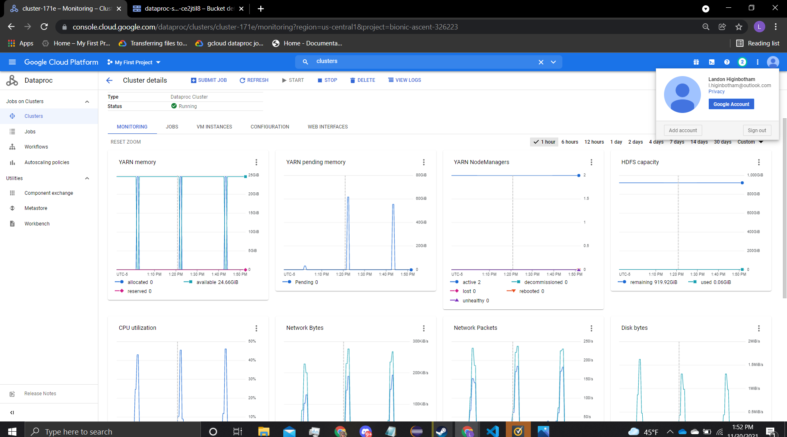
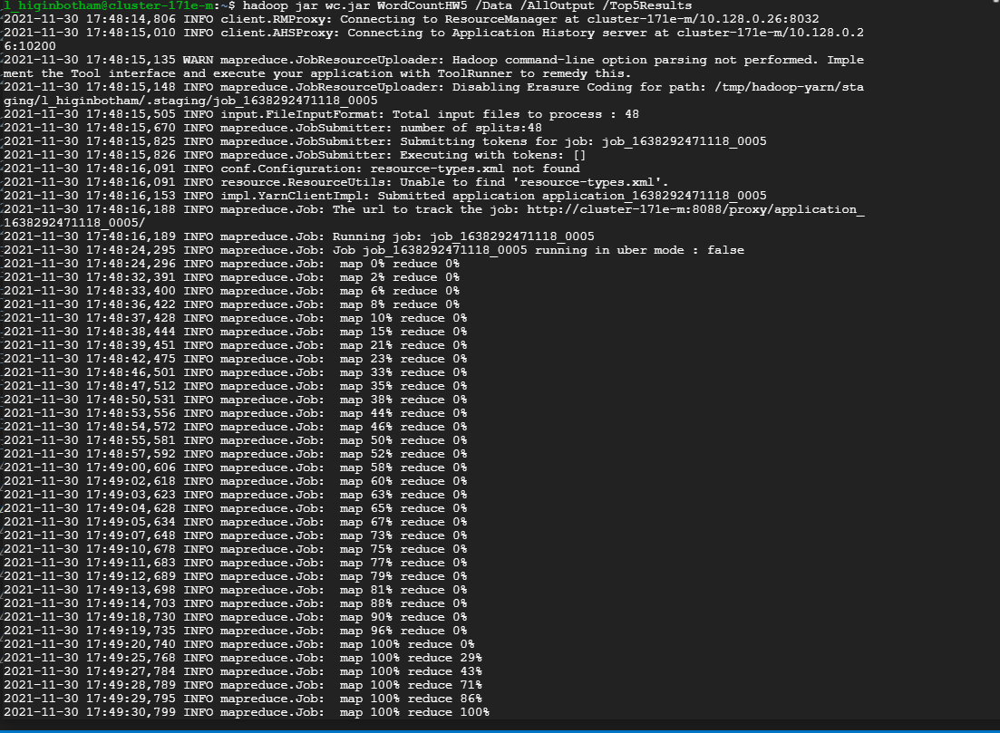
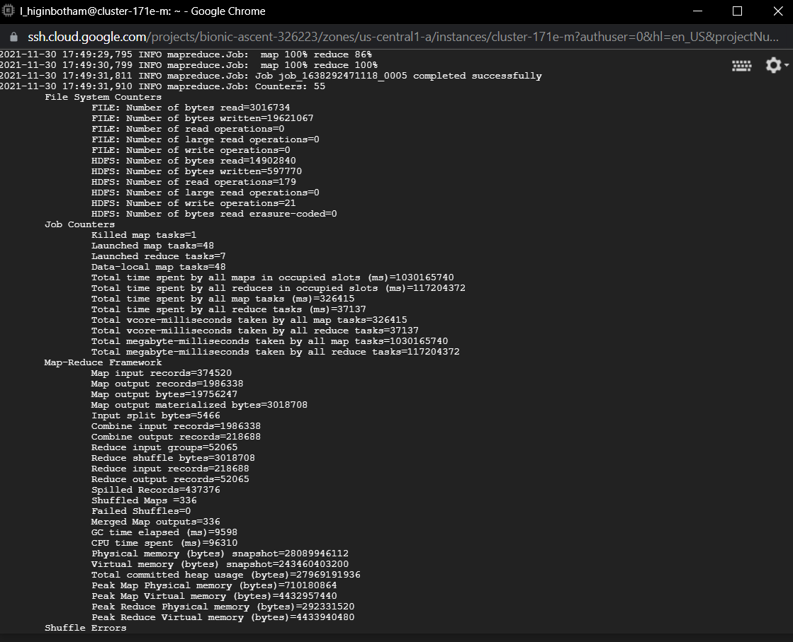
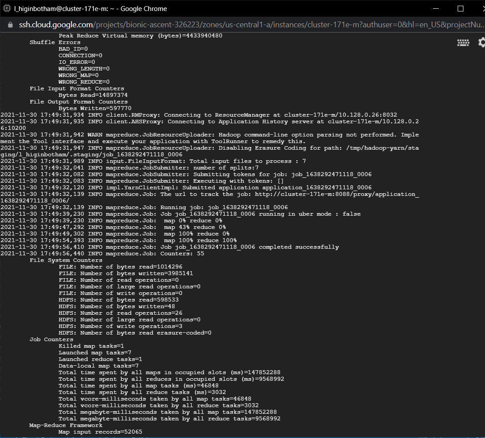
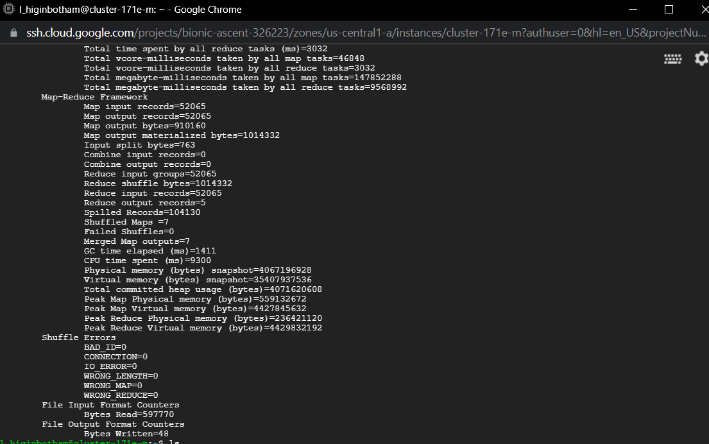
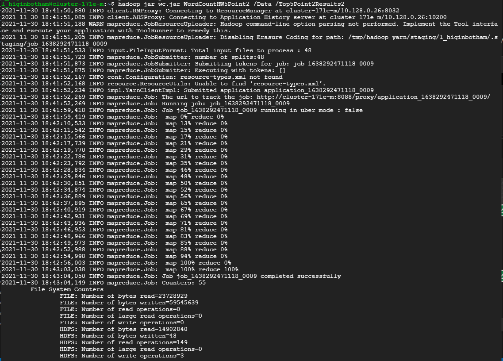
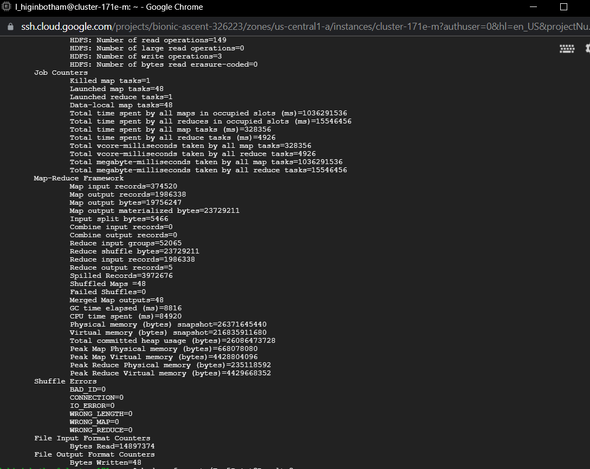
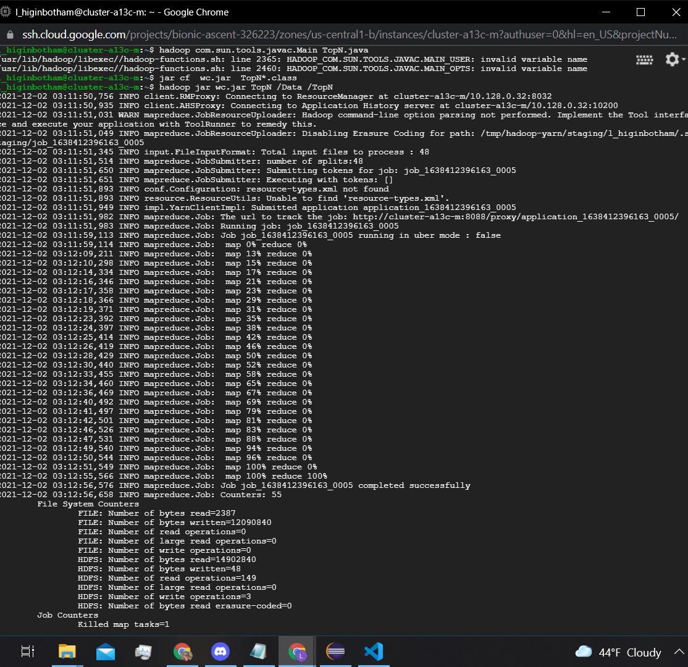
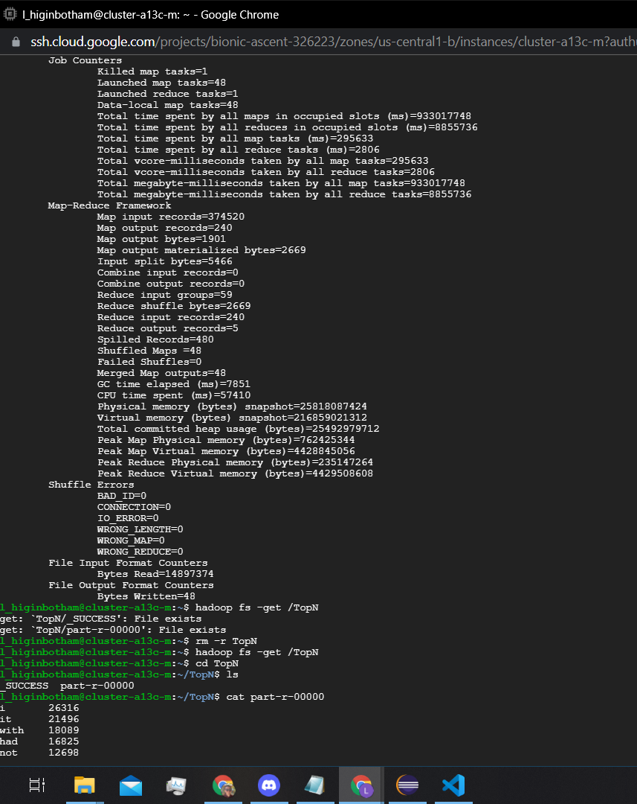

# Introduction
I took three approaches at attempting an efficient way to get the top 5 results in the files in the Data folder. Mind I did already unzip the files before running the map reduce.

** I created TopN.java which is Method 3 after class on 12/1/21 under the direction of Dr. Farag's response to someone's question **

## Method 1 (WordCountHW5.java):
My first attempt involved a job chain.
1. The first job counted and totaled all counts of the words and exported the files to the HDFS.
2. The second job took the first job's output and:
   1. Each mapper exported the top 5 words from that mapper.
   2. The reducer took the top 5 from all the mappers' outputs.
   3. The reducer compared all those values and keep the top 5 in a parallel array.
   4. On cleanup of the reducer export the top 5 total.

## Method 2 (WordCountHW5Point2.java):
This attempt completely skipped the idea of chaining the jobs. As said in class, the majority of small map reduce jobs can be found in the reading and writing of the HDFS. This means that "counting, exporting, reading, getting top 5, writing" may not be all that efficient. This attempt two is a very basic way to determine the top 5. Since we are already having the values of all the words from the first map reduce job of the last method, then why not just compare them in the reducer? This can be slower since there is only 1 reducer, however this may beat out the time to start a new job, and reading and writing from the disk. This method:
1. Counts words in the map task
2. Sums in the reduce task and compares in a parallel array to the previously determined top 5 and place the value appropriately.
3. On cleanup of the reducer export the top 5 total.

## Method 3 (TopN.java):
This is based on what Dr. Farag mentioned in class on 12/1. The idea is that efficiency is greater than accuracy. This method:
1. Counts words in each Map task.
2. Upon cleanup only write the top 5.
3. The reducer counts all results from all the map tasks
4. Upon cleanup the reducer only returns the top 5. 

# Results:
## Method 1 (WordCountHW5.java):
In the first method, the first job started at ```2021-11-30 17:48:16,189``` and ended at ```2021-11-30 17:49:31,811```. The second job started at ```2021-11-30 17:49:32,139``` and ended at ```2021-11-30 17:49:56,410```.

Job1:
```
Counters: 55
        File System Counters
                FILE: Number of bytes read=3016734
                FILE: Number of bytes written=19621067
                FILE: Number of read operations=0
                FILE: Number of large read operations=0
                FILE: Number of write operations=0
                HDFS: Number of bytes read=14902840
                HDFS: Number of bytes written=597770
                HDFS: Number of read operations=179
                HDFS: Number of large read operations=0
                HDFS: Number of write operations=21
                HDFS: Number of bytes read erasure-coded=0
        Job Counters 
                Killed map tasks=1
                Launched map tasks=48
                Launched reduce tasks=7
                Data-local map tasks=48
                Total time spent by all maps in occupied slots (ms)=1030165740
                Total time spent by all reduces in occupied slots (ms)=117204372
                Total time spent by all map tasks (ms)=326415
                Total time spent by all reduce tasks (ms)=37137
                Total vcore-milliseconds taken by all map tasks=326415
                Total vcore-milliseconds taken by all reduce tasks=37137
                Total megabyte-milliseconds taken by all map tasks=1030165740
                Total megabyte-milliseconds taken by all reduce tasks=117204372
        Map-Reduce Framework
                Map input records=374520
               Map output records=1986338
                Map output bytes=19756247
                Map output materialized bytes=3018708
                Input split bytes=5466
                Combine input records=1986338
                Combine output records=218688
                Reduce input groups=52065
                Reduce shuffle bytes=3018708
                Reduce input records=218688
                Reduce output records=52065
                Spilled Records=437376
                Shuffled Maps =336
                Failed Shuffles=0
                Merged Map outputs=336
                GC time elapsed (ms)=9598
                CPU time spent (ms)=96310
                Physical memory (bytes) snapshot=28089946112
                Virtual memory (bytes) snapshot=243460403200
                Total committed heap usage (bytes)=27969191936
                Peak Map Physical memory (bytes)=710180864
                Peak Map Virtual memory (bytes)=4432957440
                Peak Reduce Physical memory (bytes)=292331520
                Peak Reduce Virtual memory (bytes)=4433940480
        Shuffle Errors
                BAD_ID=0
                CONNECTION=0
                IO_ERROR=0
                WRONG_LENGTH=0
                WRONG_MAP=0
                WRONG_REDUCE=0
        File Input Format Counters 
                Bytes Read=14897374
        File Output Format Counters 
                Bytes Written=597770
```

Job2:
```
Counters: 55
        File System Counters
                FILE: Number of bytes read=1014296
                FILE: Number of bytes written=3985141
                FILE: Number of read operations=0
                FILE: Number of large read operations=0
                FILE: Number of write operations=0
                HDFS: Number of bytes read=598533
                HDFS: Number of bytes written=48
                HDFS: Number of read operations=26
                HDFS: Number of large read operations=0
                HDFS: Number of write operations=3
                HDFS: Number of bytes read erasure-coded=0
        Job Counters 
                Killed map tasks=1
                Launched map tasks=7
                Launched reduce tasks=1
                Data-local map tasks=7
                Total time spent by all maps in occupied slots (ms)=147852288
                Total time spent by all reduces in occupied slots (ms)=9568992
                Total time spent by all map tasks (ms)=46848
                Total time spent by all reduce tasks (ms)=3032
                Total vcore-milliseconds taken by all map tasks=46848
                Total vcore-milliseconds taken by all reduce tasks=3032
                Total megabyte-milliseconds taken by all map tasks=147852288
                Total megabyte-milliseconds taken by all reduce tasks=9568992
        Map-Reduce Framework
                Map input records=52065
                Map output records=52065
                Map output bytes=910160
                Map output materialized bytes=1014332
                Input split bytes=763
                Combine input records=0
                Combine output records=0
                Reduce input groups=52065
                Reduce shuffle bytes=1014332
                Reduce input records=52065
                Reduce output records=5
                Spilled Records=104130
                Shuffled Maps =7
                Failed Shuffles=0
                Merged Map outputs=7
                GC time elapsed (ms)=1411
                CPU time spent (ms)=9300
                Physical memory (bytes) snapshot=4067196928
                Virtual memory (bytes) snapshot=35407937536
                Total committed heap usage (bytes)=4071620608
                Peak Map Physical memory (bytes)=559132672
                Peak Map Virtual memory (bytes)=4427845632
                Peak Reduce Physical memory (bytes)=236421120
                Peak Reduce Virtual memory (bytes)=4429832192
        Shuffle Errors
                BAD_ID=0
                CONNECTION=0
                IO_ERROR=0
                WRONG_LENGTH=0
                WRONG_MAP=0
                WRONG_REDUCE=0
        File Input Format Counters 
                Bytes Read=597770
        File Output Format Counters 
                Bytes Written=48
```
## Method 2 (WordCountHW5Point2.java):
The second method, the job started at ```2021-11-30 18:41:52,269``` and ended at ```2021-11-30 18:43:04,050```

Second method job:
```
            File System Counters
                FILE: Number of bytes read=23728929
                FILE: Number of bytes written=59545639
                FILE: Number of read operations=0
                FILE: Number of large read operations=0
                FILE: Number of write operations=0
                HDFS: Number of bytes read=14902840
                HDFS: Number of bytes written=48
                HDFS: Number of read operations=149
                HDFS: Number of large read operations=0
                HDFS: Number of write operations=3
                HDFS: Number of bytes read erasure-coded=0
        Job Counters 
                Killed map tasks=1
                Launched map tasks=48
                Launched reduce tasks=1
                Data-local map tasks=48
                Total time spent by all maps in occupied slots (ms)=1036291536
                Total time spent by all reduces in occupied slots (ms)=15546456
                Total time spent by all map tasks (ms)=328356
                Total time spent by all reduce tasks (ms)=4926
                Total vcore-milliseconds taken by all map tasks=328356
                Total vcore-milliseconds taken by all reduce tasks=4926
                Total megabyte-milliseconds taken by all map tasks=1036291536
                Total megabyte-milliseconds taken by all reduce tasks=15546456
        Map-Reduce Framework
                Map input records=374520
                Map output records=1986338
                Map output bytes=19756247
                Map output materialized bytes=23729211
                Input split bytes=5466
                Combine input records=0
                Combine output records=0
                Reduce input groups=52065
                Reduce shuffle bytes=23729211
                Reduce input records=1986338
                Reduce output records=5
                Spilled Records=3972676
                Shuffled Maps =48
                Failed Shuffles=0
                Merged Map outputs=48
                GC time elapsed (ms)=8816
                CPU time spent (ms)=84920
                Physical memory (bytes) snapshot=26371645440
                Virtual memory (bytes) snapshot=216835911680
                Total committed heap usage (bytes)=26086473728
                Peak Map Physical memory (bytes)=668078080
                Peak Map Virtual memory (bytes)=4428804096
                Peak Reduce Physical memory (bytes)=235118592
                Peak Reduce Virtual memory (bytes)=4429668352
        Shuffle Errors
                BAD_ID=0
                CONNECTION=0
                IO_ERROR=0
                WRONG_LENGTH=0
                WRONG_MAP=0
                WRONG_REDUCE=0
        File Input Format Counters 
                Bytes Read=14897374
        File Output Format Counters 
                Bytes Written=48
```

## Method 3 (TopN.java):
The third method, the job started at ```2021-12-02 03:11:51,983``` and ended at ```2021-12-02 03:12:56,576```

Third method job:
```
            Counters: 55
        File System Counters
                FILE: Number of bytes read=2387
                FILE: Number of bytes written=12090840
                FILE: Number of read operations=0
                FILE: Number of large read operations=0
                FILE: Number of write operations=0
                HDFS: Number of bytes read=14902840
                HDFS: Number of bytes written=48
                HDFS: Number of read operations=149
                HDFS: Number of large read operations=0
                HDFS: Number of write operations=3
                HDFS: Number of bytes read erasure-coded=0
        Job Counters 
                Killed map tasks=1
                Launched map tasks=48
                Launched reduce tasks=1
                Data-local map tasks=48
                Total time spent by all maps in occupied slots (ms)=933017748
                Total time spent by all reduces in occupied slots (ms)=8855736
                Total time spent by all map tasks (ms)=295633
                Total time spent by all reduce tasks (ms)=2806
                Total vcore-milliseconds taken by all map tasks=295633
                Total vcore-milliseconds taken by all reduce tasks=2806
                Total megabyte-milliseconds taken by all map tasks=933017748
                Total megabyte-milliseconds taken by all reduce tasks=8855736
        Map-Reduce Framework
                Map input records=374520
                Map output records=240
                Map output bytes=1901
                Map output materialized bytes=2669
                Input split bytes=5466
                Combine input records=0
                Combine output records=0
                Reduce input groups=59
                Reduce shuffle bytes=2669
                Reduce input records=240
                Reduce output records=5
                Spilled Records=480
                Shuffled Maps =48
                Failed Shuffles=0
                Merged Map outputs=48
                GC time elapsed (ms)=7851
                CPU time spent (ms)=57410
                Physical memory (bytes) snapshot=25818087424
                Virtual memory (bytes) snapshot=216859021312
                Total committed heap usage (bytes)=25492979712
                Peak Map Physical memory (bytes)=762425344
                Peak Map Virtual memory (bytes)=4428845056
                Peak Reduce Physical memory (bytes)=235147264
                Peak Reduce Virtual memory (bytes)=4429508608
        Shuffle Errors
                BAD_ID=0
                CONNECTION=0
                IO_ERROR=0
                WRONG_LENGTH=0
                WRONG_MAP=0
                WRONG_REDUCE=0
        File Input Format Counters 
                Bytes Read=14897374
        File Output Format Counters 
                Bytes Written=48
```

## Conclusion
For this data set, method 3 (TopN.java) is the most efficient way to get the top 5 words, however this leads to some potential for inaccurate results. Method 3 (TopN.java) completed in roughly 1 minute and 5 seconds, method 2 (WordCountHW5Point2.java) in roughly 1 minute and 12 seconds, and method 1 (WordCountHW5.java) in roughly 1 minute and 40 seconds.


# Deliverables:

## Screenshot of your Cloud Account (GCP, AWS, or Azure) (25%)


## The source code you used (25%)
WordCountHW5.java (Used for method 1)
WordCountHW5Point2.java (Used for method 2)
TopN.java (Used for method 3, and the most efficient algorithm submitted)

## Screenshot of execution (25%)
### Method 1 execution





### Method 2 execution



### Method 3 execution




## Copy of the output (25%)

### With the accurate methods 1 and 2 my output was:

1. i       34293
2. it      26833
3. with    24213
4. not     21953
5. had     18348

### With the efficient, but inaccurate method 3 (TopN.java) my output was:
1. i	26316
2. it	21496
3. with	18089
4. had	16825
5. not	12698
