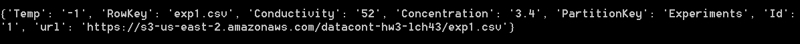

# HW3

## Github repository:
[https://github.com/lch43/CS1660](https://github.com/lch43/CS1660)

## NoSQL folder:
[https://github.com/lch43/CS1660/tree/main/Docker](https://github.com/lch43/CS1660/tree/main/NoSQL)

## Code files:
hw3.py

## Screenshot of query I used on my local machine to pull the data from my Dynamo DB:

## Screenshot of the results of the above query from my local machine's terminal:

*Query is ran in hw3.py

## IMPORTANT
Get the access key and the secret key from my comment on the assignment on canvas.